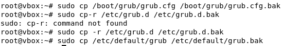

summary: Bastionado del arranque del sistema Debian
id: bastionado-linux
categories: seguridad, hardening, grub
status: Published
environments: web
feedback link: [https://github.com/PabloGonz68/ArranqueSistema.git](https://github.com/PabloGonz68/ArranqueSistema.git)

# Bastionado del arranque en Linux (Debian)

## 1. Introducción

En esta guía aprenderás a proteger el arranque de un sistema Linux basado en Debian, reforzando la configuración del gestor de arranque **GRUB2**. De esta manera, se evita que un atacante pueda modificar o acceder al sistema sin autorización.

Se cubrirán los siguientes puntos:

* Ocultación del menú de arranque.
* Configuración de contraseña en GRUB2.
* Copias de seguridad del arranque.
* Medidas adicionales de seguridad.

## 2. Requisitos previos

* Sistema operativo Debian o derivado (Ubuntu, Mint, etc.).
* Acceso de superusuario (root o sudo).
* Editor de texto como `nano` o `vim`.

## 3. Ocultar el menú de GRUB

Por defecto, GRUB muestra un menú de selección de sistema operativo al iniciar el equipo. Para evitar que un atacante pueda usarlo, lo ocultaremos.

```bash
sudo nano /etc/default/grub
```

Busca las líneas:

```
GRUB_TIMEOUT=5
```

Y reemplázalas por:

```
GRUB_TIMEOUT=0
GRUB_HIDDEN_TIMEOUT=0
```


Guarda el archivo y actualiza la configuración:

```bash
sudo update-grub
```

Esto asegura que los usuarios no vean el menú de arranque y evita intentos de manipulación del kernel o selección de otros sistemas operativos.

## 4. Proteger GRUB con contraseña

Asignaremos una contraseña al gestor de arranque para evitar modificaciones no autorizadas.

Primero, genera una contraseña cifrada:

```bash
sudo grub-mkpasswd-pbkdf2
```

Introduce la contraseña deseada y copia la salida que comienza con `grub.pbkdf2.sha512...`.

Edita el archivo de configuración personalizada:

```bash
sudo nano /etc/grub.d/40_custom
```

Agrega al final del archivo (reemplazando por tu hash generado):

```
set superusers="root"
password_pbkdf2 root grub.pbkdf2.sha512.10000...(tu hash aquí)
```


Cambia los permisos del archivo para protegerlo:

```bash
sudo chmod 700 /etc/grub.d/40_custom
```

Guarda y vuelve a actualizar GRUB:

```bash
sudo update-grub
```

Ahora, si alguien intenta editar las opciones del arranque o modificar el kernel, GRUB pedirá la contraseña configurada.

## 5. Crear una copia de seguridad del arranque

Es recomendable tener una copia de seguridad de los archivos de configuración de GRUB por si se daña o necesitamos restaurarlo.

```bash
sudo cp /boot/grub/grub.cfg /boot/grub/grub.cfg.bak
sudo cp -r /etc/grub.d /etc/grub.d.bak
sudo cp /etc/default/grub /etc/default/grub.bak
```

Para restaurar en caso necesario:

```bash
sudo cp /boot/grub/grub.cfg.bak /boot/grub/grub.cfg
sudo cp -r /etc/grub.d.bak /etc/grub.d
sudo cp /etc/default/grub.bak /etc/default/grub
```

Estas copias permiten recuperar la configuración original si algo sale mal durante el proceso.


## 6. Proteger los archivos de configuración

Ajustaremos los permisos del archivo de configuración personalizado para que solo el usuario root pueda modificarlo.

```bash
sudo chmod 700 /etc/grub.d/40_custom
```

Esto impide que otros usuarios del sistema alteren las opciones de arranque y refuerza la seguridad del sistema.

## 7. Otras medidas de seguridad

* **Cifrado del disco con LUKS (opcional):**
  Esta medida se aplica **durante la instalación de Debian**, no después.
  Permite proteger completamente los datos si alguien obtiene acceso físico al equipo.
  En el asistente de instalación, elige:


  ```
  Guiado - usar disco entero y configurar LVM con cifrado
  ```

  Luego se solicitará una contraseña para el cifrado antes de iniciar el sistema.

* **Secure Boot:** Si tu BIOS/UEFI lo permite, actívalo para garantizar que solo se carguen sistemas y controladores firmados digitalmente.

* **Revisión de logs:** Consulta regularmente `/var/log/auth.log` para detectar intentos de acceso no autorizado.

## 8. Conclusión

Con estas configuraciones, tu sistema Debian tendrá un arranque más seguro. GRUB estará protegido con contraseña, su menú oculto y los archivos de configuración restringidos, dificultando cualquier manipulación del proceso de inicio. Si además se combina con cifrado de disco y un BIOS protegido, se obtiene un arranque robusto y seguro frente a accesos no autorizados.

---

## 9. Referencias

* [Documentación oficial de GRUB2](https://www.gnu.org/software/grub/manual/grub/grub.html)
* [Guía de seguridad de Debian](https://www.debian.org/doc/manuals/securing-debian-manual/)

---

## ✍️ Autor

Pablo González Silva — Proyecto de Bastionado del arranque en Linux (Debian).
